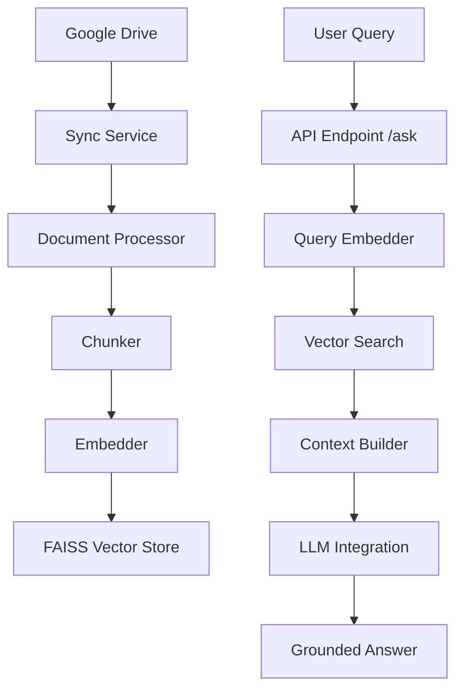

# DriveRAG

DriveRAG is a production-ready Retrieval-Augmented Generation (RAG) system that connects to Google Drive, processes documents, stores embeddings in FAISS, and answers questions using OpenAI or Anthropic LLMs.

## Architecture



## Features

- **Google Drive Integration**: OAuth 2.0 based sync for PDF, Google Docs, and TXT files.
- **Incremental Sync**: Only downloads and processes new or modified files.
- **Robust Processing**: Text extraction with cleaning and tokenizer-aware chunking.
- **Vector Search**: High-performance retrieval using FAISS.
- **Multi-LLM Support**: Configurable providers (OpenAI, Anthropic).
- **Caching**: In-memory query caching to reduce LLM costs.
- **Persistence**: SQLite database for file metadata and query history.
- **Dockerized**: Easy deployment using Docker and Docker Compose.

## Setup Instructions

### 1. Google Drive API Setup
1. Go to [Google Cloud Console](https://console.cloud.google.com/).
2. Create a new project.
3. Enable **Google Drive API**.
4. Configure **OAuth consent screen**.
5. Create **OAuth 2.0 Client IDs** (Desktop application).
6. Download the `credentials.json` file and place it in the project root.

### 2. Environment Configuration
Copy `.env.example` to `.env` and fill in your API keys:
```bash
cp .env.example .env
```

### 3. Running Locally
```bash
# Create virtual environment
python -m venv venv
source venv/bin/activate

# Install dependencies
pip install -r requirements.txt

# Start the server
python main.py
```

### 4. Running with Docker
```bash
docker-compose up --build
```

## API Endpoints

- `POST /sync-drive`: Syncs files from Google Drive to the local vector store.
- `POST /ask`: Takes a JSON query and returns an answer with sources.
- `GET /health`: Returns the health status and sync statistics.

## Sample Query

```json
{
  "query": "what is quantum computing?"
}
```

**Response:**
```json
{
"answer": "Quantum computing represents one of the most transformative technological advancements of the twenty-first century. It leverages the principles of quantum mechanics, specifically superposition and entanglement, to             perform computations at an exponentially higher speed than classical computers.",
  "sources": ["quantum_computing_case_study.pdf.pdf"]
}
```
